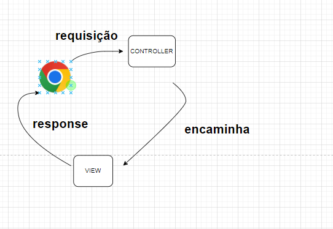

# Apontamentos

json(javaSccript Object Notation): json é um formato textual(TEXTO).
JSON é um formato de arquivo padrão aberto e formato de intercâmbio de dados que usa texto legível por humanos 
para armazenar e transmitir objetos de dados que consistem em pares e matrizes de valor-atributo. É um formato 
de dados comum com diversos usos no intercâmbio eletrônico de dados.

Ex json:
{
    "nome":"Maria",
    "sobrenome":"Pera",
    "dataNascimento":"13/11/2022",
    "endereco":{
    "logradouro":"Rua ABC",
    "numero":123
},
"dependentes":[
        {
            "id":212,
            "nome":"Ana"
        },
        {
            "id":214,
            "nome":"João"
        },
        {
            "id":158,
            "nome":"Pedro"
        }
]
}

https://jsonformatter.curiousconcept.com/

## Pilha de protocolos

## Protocolo HTTP

Protocolo HTTP que está na camada de aplicação.
O protocolo HTTP é baseado em requisição e resposta(request e response),
ou seja você faz um request ele envia um response.
Você faz uma requisição, e essa requisição deve estar associada a um método ex: GET, POST, DELETE...
O  protocolo HTTP possui 8 métodos.

O método mais usado no protocolo http é o método GET. Ex.: se sua página tem referencia para um 
arquivo CSS ele vai buscar esse arquivo CSS usando GET, se sua página tem referencia para um arquivo
JS, imagem ou vídeo  isso é feito via de regra com GET.
O método GET serve para obter/ler informações do servidor.
O método GET não é para causar nenhum  alteração/efeito colateral no servidor, ou seja mudar
o estado da aplicação, quando você insere /exclui alguma informação do BD.
O método GET serve para ler informações e não para alterar (de acordo com a semantica) informações no servidor.

Quando você faz uma requisição do tipo POST/PUT/PATCH/DELET

O POST é o segundo método mais utilizado depois do GET.
POST serve para submeter ou enviar informações para o servidor. Ou seja quando eu
quero cadastrar/inserir novos dados no servidor.

PATCH / PUT quando eu quero alterar um dado no servidor. A diferença é que o PATCH é
usado para fazer uma alteração parcial, e o PUT é para fazer uma alteração total.
Ex: quando eu quero mexer em todos os atributos de um usuário eu uso o  PUT, 
mas se for apenas um único atributo eu uso o PATCH.
Via de regra é mais comum usar o PUT na API REST.

DELETE serve para fazer uma exclusão.

Método OPTIONS ele é usado para fazer uma requisição quando você quer saber qual método HTTP
que aquela url suporta.
OPTIONS-> /OLA -> get
                -> POST

O Método TRACE serve para fazer uma requisição de teste

- O método HEAD é muito parecida com o GET, só que quando fazemos uma requisição com o GET ele retorna um
corpo na resposta (response body) . Já no HEAD você recebe a resposta sem o conteudo.
Você pode usar uma requisição tipo HEAD quando você quer verificar que uma determinada url está funcionando.

Esses métodos estarão funcionando apena entre o BROWSER e a aplicação Spring Boot, ou seja seu servidor.
Esses métodos vão estar funcionando como uma forma de comunicar entre esses dois computadores
na internet. Mas o que a sua aplicação faz com a requisição após esse processo exemplo
acessar o BD, excluir as informações não tem relação direta com o tipo de método HTTP 
que você usa, vococê pode obter um método DELETE e no final obter informações do Servidor
ou seja não tem a obrigação de usar o método DELETE para excluir, o método POST para incluit
o PUT para alterar , o GET para obter dados, o que devemos fazer é manter a consistencia entre
a semantica(significado) de cada método HTTP mais aderente voc~e estará ao padrão REST.

             _________    ---------------->    ___________ 
            |BROWNSER|                        |SPRING BOOT|  ----
            ----------   <----------------    ------------       |
                                                                 |
                                                                 V
                                                                [BD]

Os métodos HTTP servem para comunicação entre dois nós dentro da rede, mas não necessariamente o que você faz depois 
dentro da sua aplicação tem que refletir que tipo de método você usou. Mas manter a coerencia e semanticas dos verbos
é muito importante.

## GRAPHQL

Tecnologia GRAPHQL que é uma alterantiva a uma API do tipo REST.
GRAPHQL usa para inserir o método POST, para alterar um registro ele usa o método POST
para excluir ele usa o método POST e para ler ele usa o método GET. 

## url - search

https://www.google.com.br/search?q=Linux+Ubuntu&hl=pt  
                          busca   querie        language

## Passar Parametros web service

- através do PathVariable

    @GetMapping("/{id}")
    public Cliente ObterClientPorId(@PathVariable Long id){

        return new Cliente(id,"Maria","985.963.789-01");
    }

  - através do @RequestParam
  http://localhost:8080/clientes?id=123
  
      @GetMapping()
      public Cliente obterClientePorId2(@RequestParam(name="id", defaultValue = "1") Long id){
      return new Cliente(id, "João Augusto", "111.222.333-4");
      }

## Padrão MVC

Responsabilidades Model, View, Controller

Model: seria o coração da aplicação, no model vai ter as regras de negócio, as entidades, a camada de acesso a dados
tudo que pertence a aplicação no que diz respeito a regras de negócios /validação.

View: ela é a camada responsável por renderizar a resposta seja ela em aplicações desktop, seja ela em aplicações web,
ela é responsável por renderizar a página como resposta a requisição, renderizar a página significa que você vai trabalhar 
na view com JS, CSS, HTML , trabalhar com algum template engine onde vocês faz includes, laços dentro da sua pagina
para que você possa representar os dados em uma tabela. Ou seja tudo aquilo que diz respeito a visualizar a sua aplicação, ou 
seja visualizar as telas está relacionado a camada view. (a resposta, ou seja a página renderizada no browser do usuario).

Controller: a camada controller faz o controle de fluxo da camada de fluxo da aplicação.  O controller faz o intermedio 
de todo o fluxo, desde pedir para o model informações da base de dados já que ele detém essa lógica, ele detem a camada
de acesso a dados. O controller seria tipo o coordenador do fluxo da aplicação.

A primeira camada que vai receber a sua requisição é a camada controller, ou seja dentro da sua aplicação a primeira
camada que vai recepcionar é a camada Controller

        BROWSER     ->                 WEB SERVER             ->            APLICAÇÃO     ->    CONTROLLER
    gerando uma requisição|  essa requisição vai bater no seu web  |  Dentro da aplicação seu  |  
    a partir de uma url)  |  server, que pode ser um Tomcat,ngx,   |  framework vai saber para |
                          |  ou apache dependendo da tecnologia,   |   onde ele deve direcionar|  
                          |  o web server a partir da url ele vai  |                           |
                          |  saber para qual aplicação ele vai     |                           |
                          |  direcionar                            |                           |

- Fluxo do Primeiro cenário que não precisa acessar Dados, ou seja não precisa passar pela camada model( que é a camada que se liga ao BD)
Nesse primeiro cenário estou querendo mostrar uma tela no browser sem que haja necessidade de renderizar a página

O browser gera uma requisição através de uma url, e essa url vai acabar sendo mapeada no momento
para um controller.Essa requisiçao chega no meu controller, e ele vai analisar que não que não necessita de acesso 
a dados, eu não preciso validar nenhuma regra, é um sistema simples e vai encaminhar a minha requisição para
a View , a View vai renderizar a resposta enviada para o browser.

- Fluxo do Segundo cenário que  precisa acessar Dados, ou seja precisa passar pela camada model( que é a camada que se liga ao BD)

O browser vai gerar um request apartir de uma url, esse request bate no controler, e esse controller vai perceber que para obter a lista de clientes
ele vai precisar acessar o model, ele encaminha a requisição para o model, o model vai no BD e pega a lista de clientes,
pega as indormações da lista de clientes e devolve essa lista para o controller, o controller nesse momento pode precisar de mais dados
por exemplo a lista de clientes desativados, então ele vao no model de novo pega a lista de Clientes Desativados e devolve para
o controller, e ele pode fazer esse fluxo diversas vezes, até que chegue uma hora que ele tem os dados necessários para renderizar
a VIEW, ele pega passa esses dados para a view, a view usa esses dados como insumo para renderizar a resposta e após renderizar
envia essa resposta para o browser

Em outras palavras a requisição sempre chega pelo o controller, e a requisição sempre é devolvida ou seja a resposta/response é devolvida 
pela view.

## Pensando no Padrão MVC no Spring Boot

**só não foi mostrado a view

- O DispatcherServlet direciona as requisições dos usuários para os controladores de acordo com o mapeamento realizado 
nestes últimos. Esses controladores interpretam a entrada do usuário (requisições) e transformam-na em um modelo que no 
Spring MVC é representado pela Interface Model e suas implementações.

## Criação do projeto

model, composto pelo o package entities e repositories(o qual defini a interface de como você vai abstrair o acesso a dados)

## Injeção de Depencencia

Injeção de Dependencia é uma das possiveis causas de termos inversão de controle.

IoC Inverse of Control -> D.I.(Dependency injection)

             ___                  ___
            |   |                |   |
            | A |--------------> | B |
            |___|                |___|
              |
              V
        B b = new B();
    
    A é responsável por obter
    uma instancia da classe B
    Esse é um controle normal.

            framework Spring
        @RestControler
         ___                  ___
        |   |                |   |
        | A |--------------> | B |
        |___|                |___|
          |
          V
        @Autowired
        B b;

    Ao invés de fazer uma instanciação 
    eu uso a anotação @Autowired ou seja, 
     eu quero que seja inserido uma instancia
    do tipo da Classe B quem faz isso é o
    framework reponsável pela Injeção de 
    dependencia; Todos os Controles foram
    criados/instanciados pelo o spring 
    O Spring leu as anotações através do reflection
    e através dessas anotações ele injeta algum objeto
    e ele é capaz de fazer isso por que ele gerencia
    essa classe.
    Ou seja através das anotações o framework ele é responsável por procurar
    a classe B, gerar as intancias, passa todos os atributos necessarios.
    Ou seja após isso há uma inversão da sequencia normal , da lógica normal
    que seria a classe que precisa da instanciação ser responsável por criar o objeto/instancias 
    Já com a inversão de controle o spring é o responsável por fazer tudo isso.

